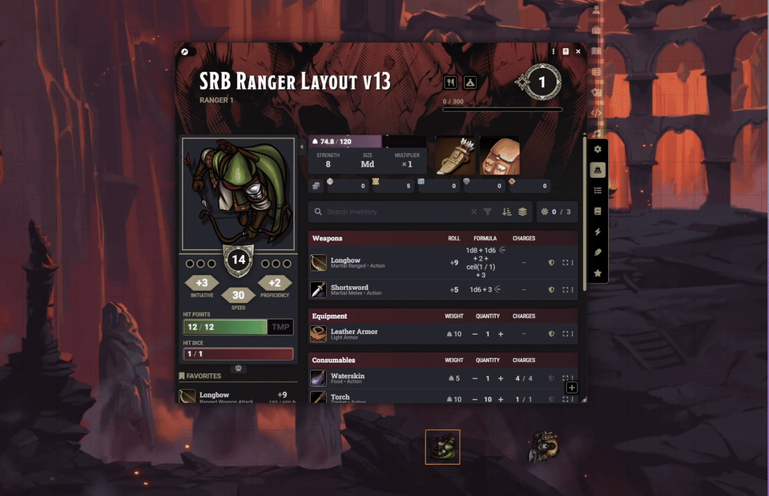

# Sephral's Roll Breakdown

Sephral's Roll Breakdown adds a compact explanation panel to supported roll chat messages in Foundry VTT.

It focuses on explaining what a roll is made of without inventing hidden sources. Dice, static modifiers, derived values, unresolved terms, and available upstream context are shown separately so the output stays technically honest.

## Demo

If the embedded preview is not available in your GitHub view, please check the media folder.

## Overview

- Adds a non-invasive breakdown panel directly to eligible chat messages
- Separates dice terms, static modifiers, computed terms, and unresolved terms
- Uses a dedicated D&D5e adapter where reliable metadata is available
- Shows Advantage and Disadvantage reasons when upstream roll data exposes them
- Falls back to a generic parser for other systems and custom roll messages
- Avoids rendering empty or trivial breakdowns when no meaningful explanation can be shown
- Supports Foundry VTT v13 and v14
- Includes English and German translations

## Features

- Compact breakdown panel rendered directly inside eligible chat messages
- Honest classification of complex roll parts without guessing hidden sources
- D&D5e-specific source resolution for supported attack, damage, save, skill, tool, concentration, and death save rolls
- Mixed D&D5e chat messages with separate attack and damage rolls are resolved per roll instead of being treated as one shared formula
- When modules such as Midi-QOL attach attribution data to the attack roll, visible Advantage and Disadvantage causes can be listed inside the breakdown
- Generic support for other systems through roll-term parsing when no dedicated adapter exists
- Client-side and world-level settings for visibility, default expansion, and debug logging

## Usage

1. Enable the module in Foundry.
2. Trigger any supported roll chat message.
3. Open the `Breakdown` section on the chat card to inspect dice, modifiers, computed terms, and unresolved terms.
4. For supported D&D5e attack rolls, check the top of the panel for concrete Advantage or Disadvantage reasons when the upstream message includes them.

## Supported systems

The module currently provides its best support for `dnd5e` and is optimized around D&D5e roll data and message structures.

Other systems can still benefit from the generic parser, but there is no guarantee that all modifiers, labels, or custom roll structures can be resolved correctly without a dedicated adapter.

## D&D5e focus

The module is currently optimized for real D&D5e play and message structures.

Supported D&D5e roll families currently include:

- Attack rolls
- Damage rolls
- Saving throws
- Ability checks
- Skill checks
- Tool checks
- Concentration saves
- Death saves

This does not mean complete coverage. D&D5e chat messages can still vary by system version, activity type, automation module, and custom table setup.

## Advantage and Disadvantage reasons

If the roll data contains explicit attribution entries, the breakdown can show why an attack was rolled with Advantage or Disadvantage.

Typical examples depend on the upstream module stack and may include things like nearby foes, flanking, visibility, stealth, prone targets, long range, or similar combat state reasons.

The module does not infer these reasons on its own. It only renders causes that are actually present in the upstream roll metadata.

## Current behavior and limits

- The module reads existing roll data from `message.rolls` and `roll.terms`.
- Static numeric terms are summarized directly.
- Computed terms such as math functions are shown as derived instead of being mislabeled.
- Symbolic or opaque terms remain marked as unknown or unresolved when no reliable source is available.
- Modifier names from systems or third-party modules are only shown when they are explicitly present in the roll data.
- Advantage and Disadvantage causes are only available when an upstream system or module writes them into the roll metadata.
- The module is currently optimized for D&D5e roll data and message structures.
- Complete coverage is not guaranteed, especially when systems or third-party modules generate roll data in custom formats.

This keeps the output technically honest, but it also means some bonus sources such as effect names or module-provided context may still appear as generic derived or unknown terms until dedicated system adapters are added.

## Feedback and parser improvements

If you want to help improve the parser further, I am happy to extend it when users can provide concrete examples, screenshots, exported chat message data, or other reproducible information about missing or mislabeled roll parts.

There is no guarantee of completeness. The parser is intentionally conservative, and I would rather leave a term unresolved than label it incorrectly.

Useful reports usually include:

- The game system and Foundry version
- The involved module stack, especially roll-altering modules
- A screenshot of the affected chat card
- The raw `ChatMessage` data or a reproducible example world setup

## Settings

- `Enable roll breakdowns` enables the module on the current client.
- `Expanded by default` opens the breakdown automatically for new supported messages.
- `Visible to players` is a world setting that allows non-GM users to see the breakdown panel.
- `Show unknown terms` keeps unresolved or unlabeled terms visible.
- `GM-only preview` is a world setting that hides the panel from players while testing.
- `Debug logging` writes parser and rendering decisions to the browser console.
